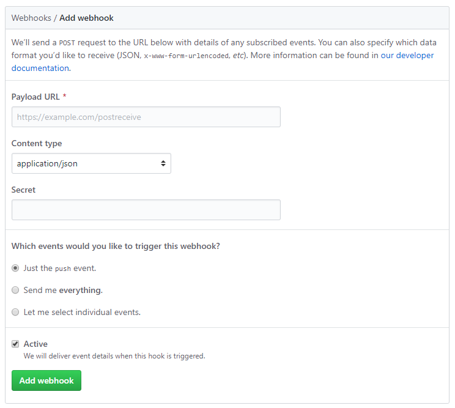

## GitHub Importer WordPress Plugin

Loads content from GitHub into WordPress posts and pages.

### Example

You're looking at it. If you're on [Nutt.net](https://www.nutt.net/wordpress-github-importer/) this content is pulled from the `readme.md` file in the repository for this plugin. If you're on GitHub, you can head over to [my site](https://www.nutt.net/wordpress-github-importer/) to see it in action.

### Installation

1. Download the zip file from GitHub
2. Unzip into a subfolder in `/wp-content/plugins`. I use `/wp-content/plugins/wordpress-github-importer/`, but any folder should work.
3. Activate the plugin

### Settings

| Setting              | Notes                                                        |
| -------------------- | ------------------------------------------------------------ |
| GitHub Token         | GitHub personal access token. This is optional unless you want to pull from private repositories. Setting a token also bumps the API rate from 60 per hour to 5,000 per hour, which is something you'd want if you're working on a relatively busy site. |
| Webhook Secret       | If you're using webhooks to update your page when a repository changes you probably want to set a matching secret here and in GitHub. |
| Clear all on webhook | If true then all GitHub caches are cleared when a webhook is successfully triggered. If not checked then only the webhook page is cleared. |
| Gist Transient Time  | Number of seconds before a Gist is considered stale and pulled again from GitHub. |

### Usage

This plugin adds a shortcode `[github_file]` that allows you to embed a file either from a GitHub repository or a Gist. The URL for the file goes between the tags. For example, you'd use the following shortcode for this file.

```
[github_file]https://github.com/ryannutt/wordpress-github-importer/blob/master/readme.md[/github_file]
```

It will also work with Gist URLs.

### Caching and Transients

Files pulled from GitHub are saved to a meta field in the associated post so that WordPress doesn't have to query the GitHub API for every page view. 

Any time the post is saved that cache is cleared so the next time the page is viewed a fresh copy of the file is downloaded from GitHub. 

The cache is also cleared if you're using a webhook so that any time an update is pushed to the GitHub repo the WordPress cache is cleared. More on webhooks in a few lines.

Gists are a little different. Instead of storing with the post meta data, Gists are stored in transients. This is because Gists don't support webhooks for automatic updating. The transients are not cleared when the page is updated in WordPress.

### Webhooks

Posts that have embedded content from a GitHub repo act as webhooks.

When GitHub sends a webhook request to a page with an embedded file the cache is cleared and refreshed next time the page is loaded.

You also have the option under settings to have the plugin clear the cache for all posts when any webhook is triggered. This is useful if you've got one repository with multiple files embedded over many WordPress posts or pages so that you don't have to list every page as a webhook. 

To set the webhook click on the Settings tab in your GitHub repo and then the Webhooks menu on the left side. You should see a form that looks like the following.



Payload URL is the permalink to the WordPress post where you're using the `[github_file]` shortcode. 

Content type should be `application/json`, which is not the default.

Secret must match the Webhook Secret setting that you setup earlier. 